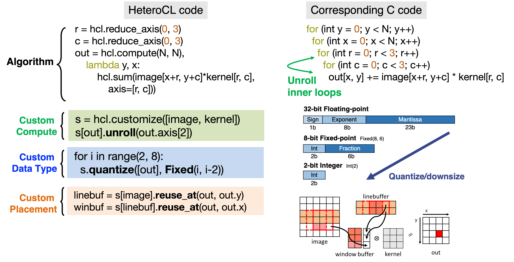
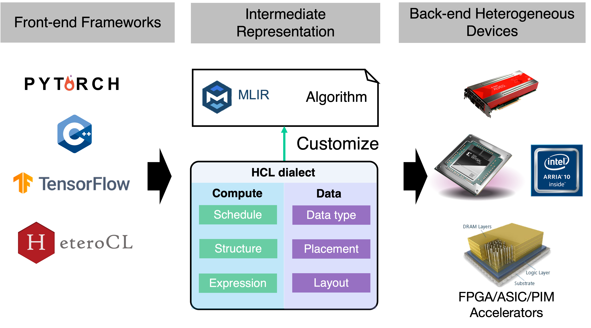

[](./LICENSE)
[](https://circleci.com/gh/cornell-zhang/heterocl/tree/master)

HeteroCL: A Multi-Paradigm Programming Infrastructure for Software-Defined Reconfigurable Computing
===================================================================================================

[Website](http://heterocl.csl.cornell.edu/web/index.html) | [Installation](http://heterocl.csl.cornell.edu/doc/installation.html) | [Tutorials](http://heterocl.csl.cornell.edu/doc/tutorials/index.html) | [Samples](http://heterocl.csl.cornell.edu/doc/samples/index.html) | [Documentation](http://heterocl.csl.cornell.edu/doc/index.html)

## Introduction

With the pursuit of improving compute performance under strict power constraints, there is an increasing need for deploying applications to heterogeneous hardware architectures with accelerators, such as GPUs and FPGAs. However, although these heterogeneous computing platforms are becoming widely available, they are very difficult to program especially with FPGAs. As a result, the use of such platforms has been limited to a small subset of programmers with specialized hardware knowledge.

To tackle this challenge, we introduce HeteroCL, a programming infrastructure comprised of a Python-based domain-specific language (DSL) and a compilation flow. 
The HeteroCL DSL provides a clean programming abstraction that decouples algorithm specification from hardware customizations including data and processing customizations. HeteroCL can further capture the interdependence among these different customization techniques, allowing programmers to explore various performance/area/accuracy trade-offs in a systematic and productive manner. 
<!-- In addition, our framework currently provides two advanced domain-specific optimizations with stencil analysis and systolic array generation, which produce highly efficient microarchitectures for accelerating popular workloads from image processing and deep learning domains. -->

## Language Overview



## Current Compilation Flow



## Install MLIR-based HeteroCL
For installing and using the HeteroCL MLIR dialect, please refer to the guide in the [HCL-MLIR](https://github.com/cornell-zhang/hcl-dialect) repository and build the dialect with Python binding. The following shows the complete script to build and connect the frontend with the MLIR flow.

```bash
git clone https://github.com/cornell-zhang/heterocl.git heterocl-mlir
cd heterocl-mlir
git checkout hcl-mlir
git submodule update --init --recursive
pip install -e ".[dev]"
# Export the generated HCL-MLIR Python library
export PYTHONPATH=$(pwd)/hcl-dialect/build/tools/hcl/python_packages/hcl_core:${PYTHONPATH}
```

To verify HeteroCL is installed correctly, we can run the following test.

```bash
python3 tests/hcl-mlir/test_gemm.py
```


## Related Publications

* Shaojie Xiang, Yi-Hsiang Lai, Yuan Zhou, Hongzheng Chen, Niansong Zhang, Debjit Pal, Zhiru Zhang. [HeteroFlow: An Accelerator Programming Model with Decoupled Data Placement for Software-Defined FPGAs](https://www.csl.cornell.edu/~zhiruz/pdfs/heteroflow-fpga2022.pdf). In FPGA, 2022.
* Yi-Hsiang Lai, Yuze Chi, Yuwei Hu, Jie Wang, Cody Hao Yu, Yuan Zhou, Jason Cong, Zhiru Zhang. [HeteroCL: A Multi-Paradigm Programming Infrastructure for Software-Defined Reconfigurable Computing](https://www.csl.cornell.edu/~zhiruz/pdfs/heterocl-fpga2019.pdf). In FPGA, 2019. (Best Paper Award)

## Related Work

* **[Stencil with Optimized Dataflow Architecture](https://vast.cs.ucla.edu/~chiyuze/pub/iccad18.pdf)** (SODA)
* **[Polyhedral-Based Systolic Array Auto-Compilation](http://cadlab.cs.ucla.edu/~jaywang/papers/iccad18-polysa.pdf)** (PolySA)
* **[Merlin Compiler](https://www.falconcomputing.com/merlin-fpga-compiler/)**
* **[Halide](https://halide-lang.org)**
* **[TVM](https://tvm.ai)**
* **[MLIR](https://arxiv.org/pdf/2002.11054.pdf)**

## Contributing to HeteroCL

### Coding Style (Python)

We follow [official Python coding style](https://www.python.org/dev/peps/pep-0008/#descriptive-naming-styles) and use [NumPy docstring style](https://numpydoc.readthedocs.io/en/latest/format.html#other-points-to-keep-in-mind).

### Coding Style (C and C++)

We follow [Google coding style](https://google.github.io/styleguide/cppguide.htm).

### Steps

1. Use [clang-format](https://clang.llvm.org/docs/ClangFormat.html) to format your C-related files. The configuration file is in `docs/.clang-format`. Following is a sample command to format the file in place. Note that you need to put the configuration file at the same directory you execute the command.

   ``clang-format -i -style=file <cpp-file>``
2. Use [Pull Request](https://help.github.com/articles/about-pull-requests/). Remember to select the most suitable labels and put it in the title.
3. Make sure all the tests pass.
